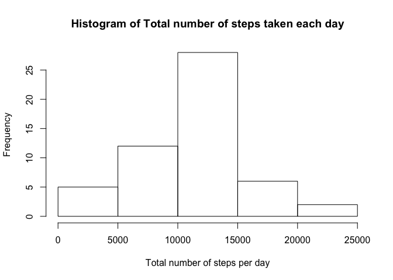
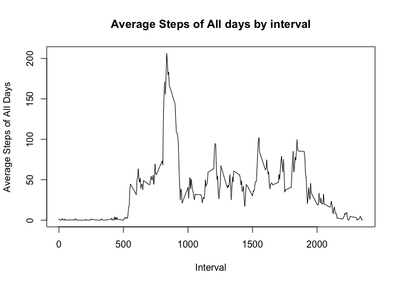
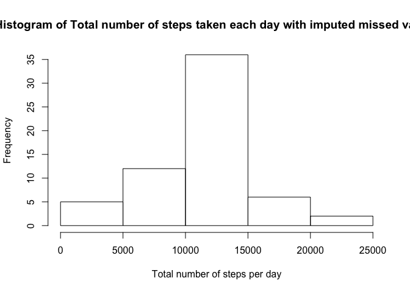
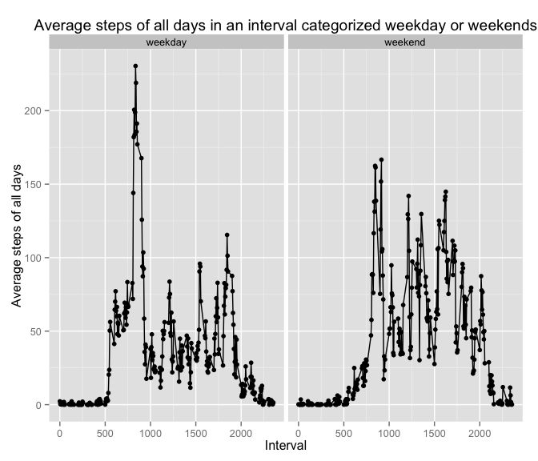

# Reproducible Research: Peer Assessment 1

```r
# set global chunk options: 
library(knitr)
```

```
## Warning: package 'knitr' was built under R version 3.1.3
```

```r
opts_chunk$set(cache=FALSE, fig.align='center')
```

```
## Warning: package 'ggplot2' was built under R version 3.1.3
```

## Loading and preprocessing the data
Unzip the file to data folder.

```r
data <- "./activity.zip"
csv <- "./data/activity.csv"
unzip(data,exdir="./data")
activity <- read.csv(csv)
activity$date <- as.Date(activity$date,"%Y-%m-%d")
activity.complete_cases <- activity[complete.cases(activity),]
```
## What is mean total number of steps taken per day?


```r
stepsPerDay <- aggregate(steps ~ date, data=activity.complete_cases,sum)
hist(stepsPerDay$steps,xlab="Total number of steps per day",main="Histogram of Total number of steps taken each day") 
```



Mean and Median of the total number of steps taken per day


```
##     Mean   Median 
## 10766.19 10765.00
```

## What is the average daily activity pattern?

```r
stepsByInterval <- aggregate(steps ~ interval, data=activity.complete_cases,mean)
plot(stepsByInterval,type="l",xlab="Interval", ylab="Average Steps of All Days", main
="Average Steps of All days by interval")
```




 
    On average across all the days in the dataset, interval 08:35 contains the maximum number of steps.

## Imputing missing values
 Total number of missing values in the dataset are 2304
 
 Imputing Strategy:
 
 Imputing missing values in an interval using the average steps of all the days in that interval.
 

```r
activity.imputed_nas <- activity
intervals <- unique(activity$interval)
for (interval in intervals){
  activity.imputed_nas[which(activity$interval==interval & is.na(activity$steps)),"steps"] <-
    stepsByInterval[which(stepsByInterval$interval==interval),"steps"]
}
stepsPerDay.imputes_nas <- aggregate(steps ~ date, data=activity.imputed_nas,sum)
```


```r
hist(stepsPerDay.imputes_nas$steps,xlab="Total number of steps per day",main="Histogram of Total number of steps taken each day with imputed missed values") 
```


After imputing the missing values, the Mean and the Median of the total number of steps taken per day


```
##     Mean   Median 
## 10766.19 10766.19
```
> There is a negligible change in the median, and mean after imputing the missing values.

## Are there differences in activity patterns between weekdays and weekends?


```r
activity.imputed_nas$wday <- as.POSIXlt(activity.imputed_nas$date)$wday

activity.imputed_nas$weekdayorweekend <- "weekday"

# 0=sunday,6 = saturday
activity.imputed_nas[which(activity.imputed_nas$wday ==6 | activity.imputed_nas$wday ==0),]$weekdayorweekend <- "weekend"


activity.imputed_nas <-transform(activity.imputed_nas,weekdayorweekend=factor(weekdayorweekend) )
avergastepsPerInterval.weekendorweekday <- aggregate(steps ~ interval + weekdayorweekend, data=activity.imputed_nas,mean)

qplot(interval, steps ,data=avergastepsPerInterval.weekendorweekday , 
       geom=c("point","line") ,
      facets= . ~ weekdayorweekend,
     main="Average steps of all days in an interval categorized weekday or weekends",
     xlab="Interval",
     ylab="Average steps of all days")
```


